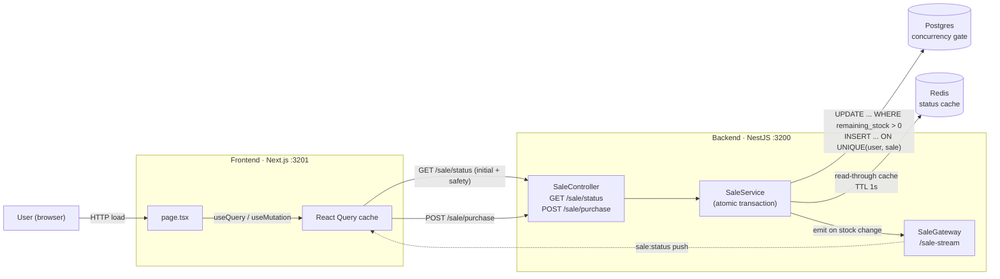

# Flash Sale System

A high-throughput, single-product flash sale built with **NestJS + Postgres + Redis + Socket.IO** on the backend and **Next.js + React Query** on the frontend. Designed around three goals from the spec: **correctness under concurrency**, **demonstrability via stress tests**, and **clear articulation of trade-offs**.

> **Headline correctness result** — from `pnpm --filter backend test:concurrency`:
>
> ```
> ✓ serves exactly N orders for stock=N when ATTEMPTS > N  (10 succeeded, 490 rejected with SOLD_OUT, 0 errors)
> ✓ one user firing 100 concurrent purchases gets exactly 1 order
> ✓ 100 concurrent calls with SAME idempotency key produce 1 order, all referencing the same orderId
> ```
>
> The system cannot oversell under load — this is enforced by a single SQL statement, not by application-layer locking.

---

## Table of contents

1. [Architecture](#architecture)
2. [Design decisions](#design-decisions-and-trade-offs)
3. [Tech stack](#tech-stack)
4. [Quick start](#quick-start)
5. [API](#api)
6. [Testing](#testing)
7. [Stress testing](#stress-testing)
8. [At higher scale: what I'd add](#at-higher-scale-what-id-add)
9. [Project structure](#project-structure)

---

## Architecture



### Request flow at a glance

| Action | Path | Backed by |
| --- | --- | --- |
| First page load | `GET /api/sale/status` | Postgres read, cached in Redis (1s TTL) |
| Live updates | WebSocket `/sale-stream` event `sale:status` | Pushed by `SaleService` on every successful purchase |
| Buy attempt | `POST /api/sale/purchase` | Atomic Postgres transaction (decrement + insert), idempotency-key dedup |

---

## Design decisions and trade-offs

The spec explicitly evaluates trade-off judgment, so this section is where most of the thinking lives.

### Concurrency control: Postgres-only, not Redis Lua

**The entire correctness story is two SQL primitives:**

```sql
-- 1. Atomic conditional decrement with row lock + DB-side time check
UPDATE sales
   SET remaining_stock = remaining_stock - 1, updated_at = NOW()
 WHERE id = $1
   AND remaining_stock > 0
   AND NOW() BETWEEN starts_at AND ends_at
RETURNING remaining_stock;

-- 2. Per-user UNIQUE constraint enforces one item per user
CREATE UNIQUE INDEX uq_orders_user_sale ON orders(user_id, sale_id);
```

Postgres serializes writers on the contended row; `WHERE remaining_stock > 0` is the gate. If 1000 requests race for stock=10, exactly 10 see a non-empty `RETURNING`. The unique constraint catches the case where one user fires multiple concurrent buys — both win the stock decrement but only one INSERT survives, and throwing inside the transaction rolls back the decrement for the loser.

**Why not Redis Lua + reconciler (the "canonical flash sale" pattern)?**
At thousands of concurrent attempts on a laptop, Postgres' row lock is not the bottleneck — Node's event loop and HTTP overhead are. Redis Lua adds a second source of truth, compensation logic, and a reconciler worker for the Redis-OK / DB-fail window. Provably correct by construction (one SQL statement) beats "fast but needs eventual reconciliation" for a take-home. The inflection point is roughly >5k sustained RPS for one item — well outside this brief.

### Idempotency: client-generated UUID per click

Every `POST /sale/purchase` carries an `Idempotency-Key: <uuid>` header generated client-side via `crypto.randomUUID()` per Buy-Now click. The server stores it on the order row (`@unique`). A replay returns the original order without re-running the transaction. This is the Stripe pattern, and it neutralizes the entire class of "network blip causes a double charge" bugs without server-side session state.

### Cache layer: Redis as read-through, NOT as the concurrency gate

`GET /sale/status` is wrapped in a 1-second read-through cache:

- Cache hit → return.
- Cache miss → DB query → populate cache → return.
- After every successful purchase, the service invalidates the cache, recomputes fresh status, and emits it over WebSocket.

This makes Redis a **performance enhancer**, not a **correctness mechanism**. If Redis goes down, the system slows but stays correct.

**Why keep Redis once WebSocket arrived?** Once live updates moved to WebSocket, polling traffic disappeared and Redis stopped being load-bearing for the steady-state case. It still earns its keep for the **thundering-herd scenario** at sale start — when N viewers refresh simultaneously the moment the sale opens, the cache coalesces them into one DB query per second. At single-pod scale this could be done with an in-process `Map`; Redis is retained because the architecture already separates "shared state" (cache + DB) from "process-local state" (the Nest app), and that separation is what lets the system scale to multiple backend pods later without rewriting `SaleService`.

### Live updates: WebSocket (socket.io), not polling

The initial spec analysis preferred polling (simpler, stateless), but WebSocket was chosen here to give users sub-second feedback on stock changes when other buyers succeed. Trade-offs:

| | WebSocket (chosen) | Polling |
| --- | --- | --- |
| Latency on stock change | ~50ms | Up to 1s |
| Server statefulness | Stateful (sticky session if scaled) | Stateless |
| Bandwidth at idle | ~0 | N × 1 req/sec |
| Reconnection complexity | Heartbeat + safety refetch | "Next request works" |

I kept the HTTP `/sale/status` endpoint for initial load + a 30-second safety refetch — if the socket drops silently, the UI reconciles within 30s instead of hanging forever. This hybrid (HTTP initial + WS deltas) is the same pattern Stripe Dashboard, Linear, and Discord use.

### No authentication

The spec asks for "a user identifier (e.g., username or email)" — not real auth. The buyer's email is sent as a plain field on `POST /sale/purchase`. Identity is enforced by the unique `email` column + the `(user_id, sale_id)` unique index. This is the spec's literal ask; adding JWT/sessions for a one-week take-home would be over-scoping.

### Single-product, single-sale: zero `saleId` in the URL

The spec is explicit: one product, one sale. So:

- `GET /sale/status` (no path param) returns "the current sale" — the most recent row in `sales`, picked by `ORDER BY starts_at DESC, created_at DESC`.
- `POST /sale/purchase` body includes `sale_id` for safety, but the frontend reads it from the same status response.
- No "list active sales" endpoint, no discovery dance. If the spec ever needs multi-sale, the migration is local: parameterize the endpoints, keep the rest.

### Deliberately omitted

| Not built | Reason |
| --- | --- |
| **BullMQ queue** | No async work on the critical path — a flash sale needs a synchronous "confirmed/sold out" response, not a "queued" response. |
| **Authentication** | Spec asks for an identifier, not auth. Adding JWT would be padding. |
| **Cloud deploy** | Spec explicitly says local Docker is fine; the architecture is env-driven so it ports to RDS/ElastiCache without code changes. |
| **Redis Lua atomic gate** | Documented above. Right answer at higher RPS, wrong scale here. |

---

## Tech stack

| Layer | Tech | Why |
| --- | --- | --- |
| **Backend framework** | NestJS 11 | Native module/DI, first-class WebSocket gateway support, Swagger generation |
| **Database** | Postgres 16 | The concurrency gate. Single-row UPDATE with `WHERE remaining_stock > 0 RETURNING` is the contract. |
| **ORM** | Prisma 6 | Migrations + generated types; raw SQL via `$queryRaw` for the hot path |
| **Cache** | Redis 7 (`ioredis`) | Read-through cache for `/sale/status` with 1s TTL |
| **WebSocket** | socket.io via `@nestjs/websockets` | Push fresh `sale:status` to all viewers on stock change |
| **Frontend framework** | Next.js 16 (App Router) | Static React with one client page; Server Components left as a future option |
| **Server state** | TanStack Query 5 | Polling-free now: WS pushes into the same cache via `setQueryData` |
| **Styling** | Tailwind CSS 4 | Utility-first, single sky-tinted palette |
| **Validation** | class-validator + ValidationPipe | DTO-level enforcement at the controller boundary |
| **Tests** | Jest, Supertest, Playwright, k6 | Unit + integration (no-oversell) + UI stress + API stress |
| **Monorepo** | pnpm workspaces + Turborepo | `apps/backend`, `apps/frontend`, shared `packages/types` |

---

## Quick start

### Prerequisites

- Node 18+ and pnpm 10+
- Docker + Docker Compose
- (Optional, for k6 stress) `brew install k6` on macOS, or [other install methods](https://k6.io/docs/get-started/installation/)

### One-time setup

```bash
git clone <repo-url>
cd flash-sale-system
pnpm install

# Start infrastructure (Postgres on :5446, Redis on :6379)
docker compose up -d

# Apply migrations and seed one product + one active sale (stock = 50)
pnpm --filter backend prisma:generate
pnpm --filter backend prisma:deploy
pnpm --filter backend db:seed
```

### Run the stack

```bash
# Terminal 1 — backend on :3200 (Swagger at /docs)
pnpm --filter backend dev

# Terminal 2 — frontend on :3201
pnpm --filter frontend dev
```

Open **http://localhost:3201**. You should see the seeded sneaker with an ACTIVE sale and live-ticking countdown. Click **Buy now** with any email → confirmation. Refresh → email is remembered, "already purchased" is shown.

To watch live stock decrements between two viewers: open the page in two tabs side-by-side and click Buy in one. The other tab updates within ~50ms via WebSocket.

---

## API

Base URL: `http://localhost:3200/api`. Full interactive Swagger UI at `http://localhost:3200/docs`.

### `GET /sale/status`

Returns the current sale and its derived state.

```json
{
  "saleId": "c1k2...",
  "productId": "c0a1...",
  "productName": "Limited Edition Sneaker",
  "productImageUrl": "https://picsum.photos/seed/sneaker/800/600",
  "startsAt": "2026-05-11T00:00:00.000Z",
  "endsAt": "2026-05-11T01:00:00.000Z",
  "totalStock": 50,
  "remainingStock": 47,
  "state": "ACTIVE"
}
```

`state` is one of `PENDING | ACTIVE | ENDED | SOLD_OUT`, derived from the time window + remaining stock.

### `POST /sale/purchase`

Attempts to purchase one item for the supplied email.

**Request:**
```http
POST /api/sale/purchase
Content-Type: application/json
Idempotency-Key: 11111111-1111-4111-8111-111111111111

{ "email": "alice@test.com", "sale_id": "c1k2..." }
```

**Responses:**

| Status | Body | Meaning |
| --- | --- | --- |
| `201` | `{ "orderId": "...", "status": "CONFIRMED" }` | Purchase successful |
| `409` | `{ "error": "SALE_NOT_STARTED" }` | Sale window hasn't opened yet |
| `409` | `{ "error": "SALE_ENDED" }` | Sale window has closed |
| `409` | `{ "error": "SOLD_OUT" }` | No stock left |
| `409` | `{ "error": "ALREADY_PURCHASED" }` | This email already has an order on this sale |
| `400` | `{ "message": "Idempotency-Key header is required" }` | Header missing/malformed, or invalid email |

Replaying the same `Idempotency-Key` returns the original `orderId` without re-running the transaction.

### WebSocket: `ws://localhost:3200/sale-stream`

socket.io namespace. Subscribe to event `sale:status` — receive the full `SaleStatusDto` shape on every server-side stock change.

```ts
import { io } from 'socket.io-client';
const socket = io('http://localhost:3200/sale-stream', { transports: ['websocket'] });
socket.on('sale:status', (status) => console.log(status));
```

---

## Testing

The test pyramid:

```
                ╱  Stress (Playwright UI + k6 API)    [Section: Stress testing]
               ╱
              ╱  Integration: no-oversell, real Postgres, real HTTP   [4 tests]
             ╱
            ╱  Unit: SaleService with mocked deps                     [13 tests]
           ╱_____________________________________________________________
```

### Unit tests

```bash
pnpm --filter backend test
```

Covers `SaleService.getStatus()` cache hit/miss/state derivation and `SaleService.purchase()` happy path + every error branch (idempotency replay, sold out, sale-not-started/ended, already-purchased, P2002 unique violation, non-P2002 rethrow).

### Integration: the headline correctness proof

```bash
# Start the throwaway test DB (tmpfs, ephemeral, port 5447)
docker compose --profile test up -d postgres-test

# Run
pnpm --filter backend test:concurrency
```

Hits a real NestJS app instance against a real Postgres via real HTTP. The marquee test fires **500 concurrent purchases against stock=10** and asserts exactly 10 succeed with the remaining 490 returning `SOLD_OUT`. There is no application-layer mutex here — the assertion only holds if the SQL guarantee holds.

Test cases:
1. **No overselling** — 500 attempts, 10 stock, 0 errors, 10 confirmed, 490 SOLD_OUT.
2. **One per user** — 100 concurrent attempts from the same email with different keys → exactly 1 order created.
3. **Idempotency replay** — 100 concurrent attempts with the same key → exactly 1 order, all responses reference the same `orderId`.
4. **Window enforcement** — pre-start sale rejected with `SALE_NOT_STARTED`, stock untouched.

---

## Stress testing

Two complementary stress tools, each targeting a different layer:

### Frontend UI stress (Playwright)

```bash
# Pre-flight: fresh seed (stock = 50)
pnpm --filter backend db:seed
# Make sure backend + frontend are running
pnpm --filter frontend stress
```

What it does: launches **150 isolated Chromium contexts**, each loading the page with a unique email and clicking Buy. Asserts that:

- exactly **50 contexts** see "Purchase confirmed"
- the rest see "Sold out" or "already purchased"
- **zero** contexts see "Something went wrong"
- every context gets an answer (no timeouts)

Expected output:
```
=== STRESS TEST RESULTS ===
stock=50, attempts=150, elapsed=~40000ms
outcomes: { success: 50, sold_out: 100, error: 0 }
===========================
```

**Why Playwright for UI stress:** it exercises the full stack — Next.js render, React Query mutation, WebSocket subscription, status banner — under genuinely concurrent users. The take-home asks the system to "handle the load without failing," and this proves the user-visible flow holds.

### Backend API stress (k6)

```bash
# Seed a fresh sale, note the printed sale_id
pnpm --filter backend db:seed
# Run k6 with 200 concurrent virtual users × 1000 iterations
k6 run apps/backend/test/stress/k6-purchase.js --env SALE_ID=<cuid_from_seed>
```

What it does: 200 concurrent VUs hammer `POST /sale/purchase` directly, bypassing the UI. Measures p95 latency and 5xx rate. **Thresholds** (the run fails if breached):

- `http_req_failed{check:no_5xx}` < 1%
- `http_req_duration{check:purchase}` p95 < 1000ms

After the run, the teardown hook prints the final stock state. You can also verify in psql:
```sql
SELECT count(*) FROM orders;        -- = initial stock (50)
SELECT remaining_stock FROM sales;  -- = 0
```

**Why both:** Playwright proves the **UI flow** doesn't crack under concurrent users. k6 proves the **backend** can sustain real-flash-sale RPS (~1000+ req/sec on the laptop tested) without overselling or 5xx. Different layers, different failure modes.

---

## At higher scale: what I'd add

These are deliberate omissions for the take-home that I'd promote in production:

| Concern | Threshold | Mitigation |
| --- | --- | --- |
| **Postgres row contention** | >5k sustained RPS for one row | Migrate the gate to a Redis Lua atomic check-and-decrement with a Postgres reconciler. Documented but not built. |
| **Single-instance WebSocket** | Multiple backend pods | Add `@socket.io/redis-adapter` so emits fan out across instances; sticky sessions on the load balancer. |
| **Order audit trail / async work** | Email confirmations, analytics events | Add BullMQ for post-purchase async jobs. Keeps the hot path synchronous, defers I/O off the response. |
| **Authentication** | Real buyers | JWT or OAuth. The current email-only contract is a placeholder. |
| **Observability** | Production debugging | OTEL traces around the transaction; Prometheus metrics on `sale_purchase_total` by outcome. |
| **Rate limiting** | Bot traffic | Per-IP rate limit at the gateway; CAPTCHA on the Buy button if abuse detected. |
| **Multi-sale support** | Spec evolves beyond single-product | Add `GET /sales/active` for discovery; parameterize endpoints with `:saleId`. |

The point isn't that these are missing — it's that the current architecture **doesn't have to be rewritten** to add them. The Postgres gate, the Redis cache pattern, the React Query store, and the env-driven config all survive.

---

## Project structure

```
flash-sale-system/
├── apps/
│   ├── backend/                       NestJS API + WebSocket
│   │   ├── prisma/
│   │   │   ├── schema.prisma          Product, Sale, User, Order
│   │   │   ├── migrations/
│   │   │   └── seed.ts                Idempotent: one sale, stock = 50
│   │   ├── src/
│   │   │   ├── sale/
│   │   │   │   ├── sale.service.ts    The atomic transaction lives here
│   │   │   │   ├── sale.controller.ts
│   │   │   │   ├── sale.gateway.ts    /sale-stream WS gateway
│   │   │   │   ├── sale.service.spec.ts
│   │   │   │   └── errors/error.ts    Typed BusinessError + ErrorCode
│   │   │   ├── db/                    PrismaService (global)
│   │   │   ├── cache/                 RedisService (global)
│   │   │   ├── health/                /health probe
│   │   │   └── common/
│   │   │       ├── filters/           BusinessError → 409 mapping
│   │   │       └── pipes/             Idempotency-Key extraction
│   │   └── test/
│   │       ├── no-oversell.e2e-spec.ts    Integration: the headline test
│   │       └── stress/k6-purchase.js      Backend load test
│   └── frontend/                       Next.js + React Query
│       ├── app/
│       │   ├── page.tsx               Composition; reads from hooks
│       │   ├── query-provider.tsx     QueryClient at the root
│       │   └── components/            Presentation only, integration-agnostic
│       ├── libs/
│       │   ├── api-endpoints.ts       Pure fetch functions
│       │   └── api-hooks.ts           useSaleStatus + WS, usePurchase, usePersistedEmail
│       ├── types/index.ts             Mirror of backend DTOs
│       └── tests/stress/              Playwright UI stress test
├── packages/types/                    Shared TS types (workspace)
├── docker-compose.yml                 Postgres + Redis + ephemeral test DB
└── turbo.json                         Monorepo task orchestration
```

---

## Notes for the reviewer

- The single most important file to read is **[apps/backend/src/sale/sale.service.ts](apps/backend/src/sale/sale.service.ts)** — the `purchase()` method is the entire correctness story in ~80 lines.
- The single most important test to run is **`pnpm --filter backend test:concurrency`** — it's the proof of no-overselling.
- Design rationale lives in this README, not scattered across code comments. The trade-off discussion above is the answer to "explain your architectural choices."

Estimated time to first running stack from a clean clone: **~3 minutes** (assuming Docker and pnpm are installed).
