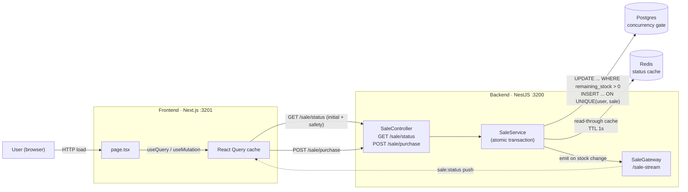

# Flash Sale System

A single-product flash sale system built with **NestJS + Postgres + Redis + Socket.IO** on the backend and **Next.js + React Query** on the frontend. Designed around three goals from the spec: **correctness under concurrency**, **demonstrability via stress tests**, and **clear articulation of trade-offs**.

> **Headline correctness result** — from `pnpm --filter backend test:concurrency`:
>
> ```
> ✓ serves exactly N orders for stock=N when ATTEMPTS > N  (e.g. 10 succeeded, 490 rejected with SOLD_OUT, 0 errors)
> ✓ one user firing 100 concurrent purchases gets exactly 1 order
> ✓ 100 concurrent calls with SAME idempotency key produce 1 order, all referencing the same orderId
> ```
>
> The system cannot oversell under load — this is enforced by a single SQL statement.

---

## Table of contents

1. [Architecture](#architecture)
2. [Tech stack](#tech-stack)
3. [Quick start](#quick-start)
4. [API](#api)
5. [Testing](#testing)
6. [Stress testing](#stress-testing)
7. [Project structure](#project-structure)

---

## Architecture



## Tech stack

| Layer | Tech | Why |
| --- | --- | --- |
| **Backend framework** | NestJS 11 | Native module/DI, first-class WebSocket gateway support, Swagger generation |
| **Database** | Postgres 16 | The concurrency gate. Single-row UPDATE with `WHERE remaining_stock > 0 RETURNING` is the contract. |
| **ORM** | Prisma 6 | Migrations + generated types; raw SQL via `$queryRaw` for the hot path |
| **Cache** | Redis 7 (`ioredis`) | Read-through cache for `/sale/status` with 1s TTL |
| **WebSocket** | socket.io via `@nestjs/websockets` | Push fresh `sale:status` to all viewers on stock change |
| **Frontend framework** | Next.js 16 (App Router) | Static React with one client page; Server Components left as a future option |
| **Server state** | TanStack Query 5 | Polling-free now: WS pushes into the same cache via `setQueryData` |
| **Styling** | Tailwind CSS 4 | Utility-first, single sky-tinted palette |
| **Validation** | class-validator + ValidationPipe | DTO-level enforcement at the controller boundary |
| **Tests** | Jest, Supertest, Playwright, k6 | Unit + integration (no-oversell) + UI stress + API stress |
| **Monorepo** | pnpm workspaces + Turborepo | `apps/backend`, `apps/frontend`, shared `packages/types` |

---

### Request flow at a glance

| Action | Path | Backed by |
| --- | --- | --- |
| First page load | `GET /api/sale/status` | Postgres read, cached in Redis (1s TTL) |
| Live updates | WebSocket `/sale-stream` event `sale:status` | Pushed by `SaleService` on every successful purchase |
| Buy attempt | `POST /api/sale/purchase` | Atomic Postgres transaction (decrement + insert), idempotency-key dedup |

---

## Quick start

### Prerequisites

- Node 18+ and pnpm 10+
- Docker + Docker Compose
- (for k6 stress) `brew install k6` on macOS

### One-time setup

```bash
git clone <repo-url>
cd flash-sale-system
pnpm install

# Start infrastructure (Postgres on :5446, Redis on :6379)
pnpm infra:up

# Stop infrastructure
pnpm infra:down

# Apply migrations 
pnpm --filter backend prisma:generate
pnpm --filter backend prisma:migrate

# Insert flash sale (for quick test)
pnpm -w run command insert-sale qty={stockQty}
```

### Run the stack

```bash
pnpm dev
```

Open **http://localhost:3201**. You should see the inserted product (sneaker) with an ACTIVE sale and live-ticking countdown. Click **Buy now** with any email → confirmation. Refresh → email is remembered, "already purchased" is shown.

To watch live stock decrements between two viewers: open the page in two tabs side-by-side and click Buy in one. The other tab updates within ~50ms via WebSocket.

---

## API

Base URL: `http://localhost:3200/api`. Swagger UI at `http://localhost:3200/docs`.

### `GET /sale/status`

Returns the current sale and its derived state.

```json
{
  "saleId": "c1k2...",
  "productId": "c0a1...",
  "productName": "Limited Edition Sneaker",
  "productImageUrl": "https://picsum.photos/seed/sneaker/800/600",
  "startsAt": "2026-05-11T00:00:00.000Z",
  "endsAt": "2026-05-11T01:00:00.000Z",
  "totalStock": 50,
  "remainingStock": 47,
  "state": "ACTIVE"
}
```

`state` is one of `PENDING | ACTIVE | ENDED | SOLD_OUT`, derived from the time window + remaining stock.

### `POST /sale/purchase`

Attempts to purchase one item for the supplied email.

**Request:**
```http
POST /api/sale/purchase
Content-Type: application/json
Idempotency-Key: 11111111-1111-4111-8111-111111111111

{ "email": "alice@test.com", "sale_id": "c1k2..." }
```

**Responses:**

| Status | Body | Meaning |
| --- | --- | --- |
| `201` | `{ "orderId": "...", "status": "CONFIRMED" }` | Purchase successful |
| `409` | `{ "error": "SALE_NOT_STARTED" }` | Sale window hasn't opened yet |
| `409` | `{ "error": "SALE_ENDED" }` | Sale window has closed |
| `409` | `{ "error": "SOLD_OUT" }` | No stock left |
| `409` | `{ "error": "ALREADY_PURCHASED" }` | This email already has an order on this sale |
| `400` | `{ "message": "Idempotency-Key header is required" }` | Header missing/malformed, or invalid email |

Replaying the same `Idempotency-Key` returns the original `orderId` without re-running the transaction.

### WebSocket: `ws://localhost:3200/sale-stream`

socket.io namespace. Subscribe to event `sale:status` — receive the full `SaleStatusDto` shape on every server-side stock change.

```ts
import { io } from 'socket.io-client';
const socket = io('http://localhost:3200/sale-stream', { transports: ['websocket'] });
socket.on('sale:status', (status) => console.log(status));
```

---

## Testing

The test pyramid:

```
                ╱  Stress (Playwright UI + k6 API)    [Section: Stress testing]
               ╱
              ╱  Integration: no-oversell, real Postgres, real HTTP   [4 tests]
             ╱
            ╱  Unit: SaleService with mocked deps                     [13 tests]
           ╱_____________________________________________________________
```

### Unit tests

```bash
pnpm --filter backend test
```

Covers `SaleService.getStatus()` cache hit/miss/state derivation and `SaleService.purchase()` happy path + every error branch (idempotency replay, sold out, sale-not-started/ended, already-purchased, P2002 unique violation, non-P2002 rethrow).

### Integration: the headline correctness proof

```bash
# Start the throwaway test DB (tmpfs, ephemeral, port 5447)
docker compose --profile test up -d postgres-test

# Run
pnpm --filter backend test:concurrency
```

Hits a real NestJS app instance against a real Postgres via real HTTP. The marquee test fires **500 concurrent purchases against stock=10** and asserts exactly 10 succeed with the remaining 490 returning `SOLD_OUT`. There is no application-layer mutex here — the assertion only holds if the SQL guarantee holds.

Test cases:
1. **No overselling** — 500 attempts, 10 stock, 0 errors, 10 confirmed, 490 SOLD_OUT.
2. **One per user** — 100 concurrent attempts from the same email with different keys → exactly 1 order created.
3. **Idempotency replay** — 100 concurrent attempts with the same key → exactly 1 order, all responses reference the same `orderId`.
4. **Window enforcement** — pre-start sale rejected with `SALE_NOT_STARTED`, stock untouched.

---

## Stress testing

Two complementary stress tools, each targeting a different layer:

### Frontend UI stress (Playwright)

```bash
# Pre-flight: fresh insert (stock = 100)
pnpm -w run command insert-sale qty=100
# Make sure backend + frontend are running
pnpm --filter frontend stress
```

What it does: launches **150 isolated Chromium contexts**, each loading the page with a unique email and clicking Buy. Asserts that:

- exactly **100 contexts** see "Purchase confirmed"
- the rest see "Sold out" or "already purchased"
- **zero** contexts see "Something went wrong"
- every context gets an answer (no timeouts)

Expected output:
```
=== STRESS TEST RESULTS ===
stock=100, attempts=150, elapsed=~40000ms
outcomes: { success: 100, sold_out: 100, error: 0 }
===========================
```

**Why Playwright for UI stress:** it exercises the full stack — Next.js render, React Query mutation, WebSocket subscription, status banner — under genuinely concurrent users. The take-home asks the system to "handle the load without failing," and this proves the user-visible flow holds.

### Backend API stress test (k6)

```bash
# Insert a fresh sale, note the printed sale_id
pnpm -w run command insert-sale qty=100
# Run k6 with 200 concurrent virtual users × 1000 iterations
k6 run apps/backend/test/stress/k6-purchase.js --env SALE_ID=<cuid_from_seed>
```

---

## Project structure

```
flash-sale-system/
├── apps/
│   ├── backend/                       NestJS API + WebSocket
│   │   ├── prisma/
│   │   │   ├── schema.prisma          Product, Sale, User, Order
│   │   │   ├── migrations/
│   │   │   └── seed.ts                Idempotent: one sale, stock = 50
│   │   ├── src/
│   │   │   ├── sale/
│   │   │   │   ├── sale.service.ts    The atomic transaction lives here
│   │   │   │   ├── sale.controller.ts
│   │   │   │   ├── sale.gateway.ts    /sale-stream WS gateway
│   │   │   │   ├── sale.service.spec.ts
│   │   │   │   └── errors/error.ts    Typed BusinessError + ErrorCode
│   │   │   ├── db/                    PrismaService (global)
│   │   │   ├── cache/                 RedisService (global)
│   │   │   ├── health/                /health probe
│   │   │   └── common/
│   │   │       ├── filters/           BusinessError → 409 mapping
│   │   │       └── pipes/             Idempotency-Key extraction
│   │   └── test/
│   │       ├── no-oversell.e2e-spec.ts    Integration: the headline test
│   │       └── stress/k6-purchase.js      Backend load test
│   └── frontend/                       Next.js + React Query
│       ├── app/
│       │   ├── page.tsx               Composition; reads from hooks
│       │   ├── query-provider.tsx     QueryClient at the root
│       │   └── components/            Presentation only, integration-agnostic
│       ├── libs/
│       │   ├── api-endpoints.ts       Pure fetch functions
│       │   └── api-hooks.ts           useSaleStatus + WS, usePurchase, usePersistedEmail
│       ├── types/index.ts             Mirror of backend DTOs
│       └── tests/stress/              Playwright UI stress test
├── packages/types/                    Shared TS types (workspace)
├── docker-compose.yml                 Postgres + Redis + ephemeral test DB
└── turbo.json                         Monorepo task orchestration
```

---

Estimated time to first running stack from a clean clone: **~3 minutes** (assuming Docker and pnpm are installed).
